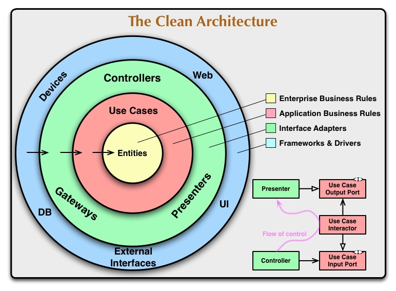
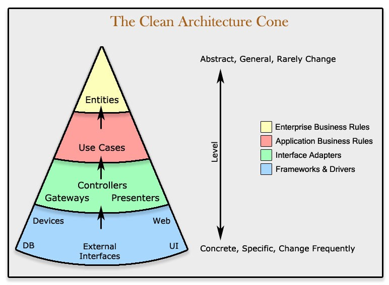

# HakolBesWeather!

## Background

As part of BIU-DS18 course the participants needs to submit a python project for **demonstrating the skills** they have gained during the course so far:

- Understanding the Python programming language.
- Working with Data Science oriented Python packages such as `pandas` and `seaborn`.
- Retrieving data form external sources using their API and the `requests` package.
- Creating UI Widgets using the `streamlit` package.
- Working with version-control-systems (Git) to manage and deploy the codebase.

Those skills are all combined to create a basic weather-forecast application.

## Usage

Using the app is available by Streamlit cloud service ([link](https://hakolbesweather.streamlit.app/))

For local installation:
1. Clone the app repo
2. Use the `pyproject.toml` and `poetry.lock` files for setting up the environment
3. run `streamlit run main.py`

## Project structure

### Philosophy - the Clean Architecture

I always wanted to give uncle Bob [Clean Architecture](https://blog.cleancoder.com/uncle-bob/2012/08/13/the-clean-architecture.html) design  a chance.

Uncle Bob's "Clean Architecture" emphasizes creating maintainable, testable, and flexible systems by organizing code into distinct layers with clear separation of concerns. The core idea is that the inner layers, which contain business rules and application logic, are completely independent of outer layers, such as frameworks, databases, or UI. Following the Dependency Rule, dependencies flow inward, ensuring that high-level policies are unaffected by changes in low-level implementations, making the system easier to adapt, test, and extend over time.

## Project structure - Feature Folders

In a wonderful article called ["Clean Architecture is NOT a project structure"](https://medium.com/@stevebishop_89684/clean-architecture-is-not-a-project-structure-b158c9c4163f) by Steve Bishop, we learn that while Clean Architecture presents us with a conceptual partition for the application roles, applying this partition to our code structure is a mistaken interpretation of the idea.

Having a project structure based on the Clean Architecture: for example four folders named "Entities", "Use Cases", "Adapters", "Frameworks" is a "Vertically" representation of the code, grouping together foreign features.

As code tends to grown Horizontally - meaning more features in the existing code layers, it makes more sense to use a Feature Folder structure, where each folder contain all relevant code of a specific feature.

Visually it looks like we "sliced" the Architecture chart into "Cones", where each cones has its own folder:

### Applying the architecture to the weather app

As a matter of fact, this architecture is more of a code philosophy than an actual applicable pattern, but non the less I found it very helpful for this particular project.

The project follows MVP guidelines, with location and forecast data being declared as Models,
using Streamlit as View and implementing middle layers as presenters/controllers.

Following Uncle Bob Clean Architecture philosophy, the MVP is implemented such that:
* A forecast widget depends on a forecast data presenter.
  * The Presenter is giving a `pandas.DataFrame` and the `streamlit` components are used to visually displaying the data
  * This means that any UI framewrok could have been used as long it knows to handle the `pandas.DataFrame`
  * Hence, the View depends on the presenter interface, but the presenter is unaware of the View implementation
* The presenter depends on a factory method to create a forecast model
    * The factory method is used to create a `HourlyForecast`, `DailyForecast` or `CurrentWeather` info.
    * It uses external API to retrieve the data and create a `pydantic.BaseModel` object
    * The presenter then receives a the Model parameters as dictionary, and turn them into presentable `DataFrame`s
    * The presenter has no footing in HOW the Model is being created, this functionality is implemented in the Factory
* The factory methods depends on the Model strict definition
    * The model is strictly declared to have certain fields
    * The factory depends on this declaration in the context it has to get the data to each field
    * The factory uses https://open-meteo.com/ API, but can easily be replaced with any other API - as long it can get all required Model data.
  * the Model is the heart of the program, and has zero knowledge about outer layers

#### Feature folders

Usage of feature folders can be seen in `weather_forecast` and `city_geolocation` folders,
where the above "Clean MVP" approach is used.

It is also used in the `map` folder, which contains an "Outer Layer"-only logic.

